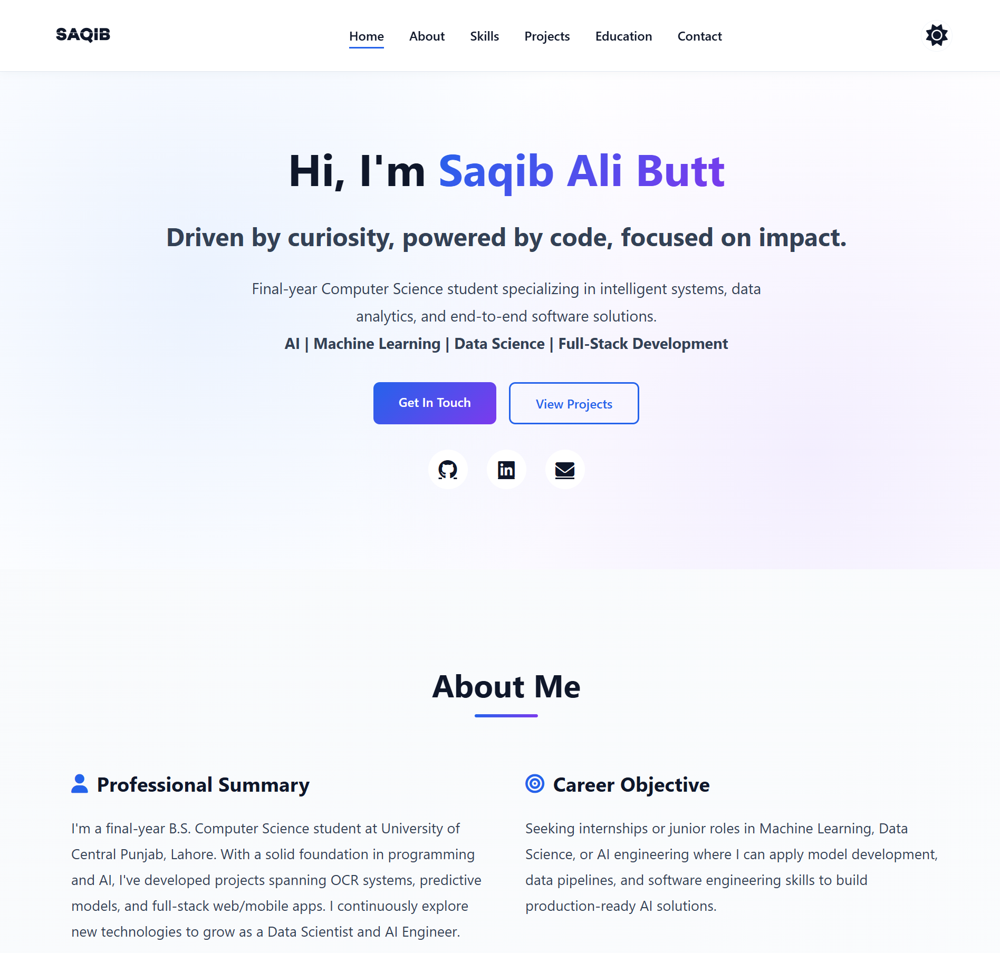

<div align="center">

# Saqib Ali Butt - Portfolio

_A modern, responsive, and feature-rich portfolio website built with vanilla HTML, CSS, and JavaScript._

<p align="center">
  <a href="YOUR_LIVE_PREVIEW_URL_HERE" target="_blank">
    
  </a>
</p>

</div>

<p align="center">
  <a href="https://github.com/Saqibb786/Saqib-Portfolio/blob/main/LICENSE"></a>
  <a href="https://github.com/Saqibb786/Saqib-Portfolio/stargazers"></a>
  <a href="https://github.com/Saqibb786/Saqib-Portfolio/network/members"></a>
  <a href="https://github.com/Saqibb786/Saqib-Portfolio/issues"></a>
</p>

<div align="center">
  <a href="#">
    
  </a>
</div>

<details>
  <summary><strong>Table of Contents</strong></summary>
  <ol>
    <li><a href="#about-the-project">About The Project</a></li>
    <li><a href="#key-features">Key Features</a></li>
    <li><a href="#tech-stack">Tech Stack</a></li>
    <li><a href="#project-structure">Project Structure</a></li>
    <li><a href="#getting-started">Getting Started</a></li>
    <li><a href="#roadmap">Roadmap</a></li>
    <li><a href="#contributing">Contributing</a></li>
    <li><a href="#license">License</a></li>
    <li><a href="#contact">Contact</a></li>
    <li><a href="#acknowledgments">Acknowledgments</a></li>
  </ol>
</details>

## About The Project

This portfolio website is a testament to my passion for software development and design. It's a single-page application built from the ground up using fundamental web technologies. The goal was to create a modern, clean, and responsive portfolio that not only showcases my work but also demonstrates my skills in front-end development.

## Key Features

- 🎨 **Modern & Clean UI:** Aesthetically pleasing design with a focus on user experience.
- 📱 **Fully Responsive:** Adapts seamlessly to all screen sizes, from mobile to desktop.
- 🌓 **Light/Dark Theme:** A theme toggle for a comfortable viewing experience in any lighting condition.
- ✨ **Smooth Animations:** Subtle animations and transitions that bring the website to life.
- 🚀 **Fast & Lightweight:** Optimized for performance with no heavy frameworks or libraries.
- 📫 **Contact Form:** A functional contact form powered by EmailJS for easy communication.

## Tech Stack

| Technology       | Description                                                                                            |
| ---------------- | ------------------------------------------------------------------------------------------------------ |
| **HTML5**        | The backbone of the website, structured with semantic HTML5.                                           |
| **CSS3**         | Styled with modern CSS3, including Flexbox, Grid, and custom properties for theming.                   |
| **JavaScript**   | Vanilla JavaScript for all the dynamic functionality, including the theme toggle and smooth scrolling. |
| **Font Awesome** | A comprehensive icon library used throughout the website.                                              |
| **EmailJS**      | A service that allows sending emails directly from JavaScript, used for the contact form.              |

## Project Structure

```
.Saqib Portfolio/
├── Assets/
│   ├── logo1.png
│   ├── logo2.png
│   ├── logo3.png
│   └── logo5.png
├── index.html
├── script.js
└── styles.css
```

## Getting Started

To get a local copy up and running, follow these simple steps.

1.  **Clone the repository:**
    ```sh
    git clone https://github.com/Saqibb786/Saqib-Portfolio.git
    ```
2.  **Navigate to the project directory:**
    ```sh
    cd Saqib-Portfolio
    ```
3.  **Open `index.html` in your browser.**

## Contributing

Contributions are what make the open-source community such an amazing place to learn, inspire, and create. Any contributions you make are **greatly appreciated**.

If you have a suggestion that would make this better, please fork the repo and create a pull request. You can also simply open an issue with the tag "enhancement".

Don't forget to give the project a star! Thanks again!

1.  Fork the Project
2.  Create your Feature Branch (`git checkout -b feature/AmazingFeature`)
3.  Commit your Changes (`git commit -m 'Add some AmazingFeature'`)
4.  Push to the Branch (`git push origin feature/AmazingFeature`)
5.  Open a Pull Request

## License

Distributed under the MIT License. See `LICENSE` for more information.

## Contact

Saqib Ali Butt - [saqibbutt10000@gmail.com](mailto:saqibbutt10000@gmail.com)

Project Link: [https://github.com/Saqibb786/Saqib-Portfolio](https://github.com/Saqibb786/Saqib-Portfolio)

## Acknowledgments

- [Img Shields](https://shields.io)
- [Font Awesome](https://fontawesome.com)
- [EmailJS](https://www.emailjs.com/)
